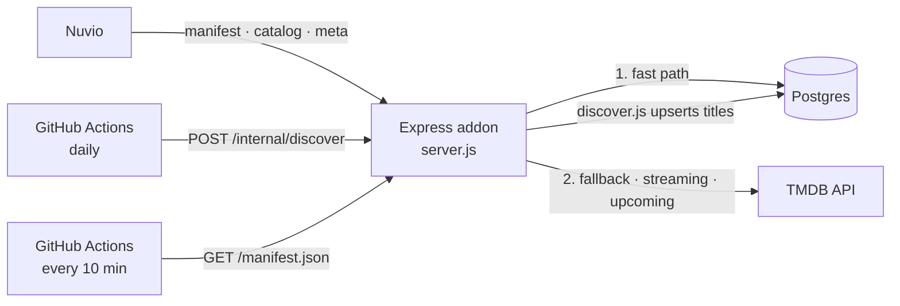

<div align="center">

# 🇩🇰 Danish Nuvio Catalog

**Danish movies and TV series for [Nuvio](https://nuvioapp.space/) — curated catalogs, streaming-service filters, upcoming releases and search.**

[](https://danish-nuvio-catalog.onrender.com)
[](https://github.com/ekstrapc210100/Danish-Nuvio-Catalog/actions/workflows/discover.yml)
[](https://github.com/ekstrapc210100/Danish-Nuvio-Catalog/actions/workflows/keepalive.yml)
[](https://nodejs.org)
[](https://www.themoviedb.org/)

**[Install the addon →](https://danish-nuvio-catalog.onrender.com)**

</div>

---

> **This is a catalog addon, not a stream addon.** It provides catalog
> entries and metadata only. It does **not** provide video streams — a
> separate stream source is required for playback in Nuvio.

## ✨ Highlights

- 🎬 **21 curated catalogs** by genre, popularity, rating and release period
- 📺 **16 optional streaming catalogs** — Danish titles on Netflix, Disney+,
  Prime Video, Viaplay, HBO Max, SkyShowtime, TV 2 Play, DRTV and Nordisk Film+
- 🗓️ **Kommer snart** — upcoming Danish films and series with exact release dates
- 🔎 **Search**, scoped to Danish titles
- 🧩 **Build your own** — a web installer lets you pick catalogs and create
  custom categories (genre, rating, years, sort order)
- 🗄️ **Fast** — catalogs are served from a Postgres database that fills itself
  from TMDB every day, and fall back to live TMDB automatically
- 🇩🇰 Metadata in Danish: posters, backdrops, cast, directors and trailers

## 📚 Contents

- [Install in Nuvio](#-install-in-nuvio)
- [Catalogs](#-catalogs)
- [How it works](#-how-it-works)
- [Configuration](#-configuration)
- [Run locally](#-run-locally)
- [Deployment](#-deployment)
- [Project structure](#-project-structure)
- [TMDB attribution](#-tmdb-attribution)
- [License](#-license) · [Disclaimer](#-disclaimer)

## 📲 Install in Nuvio

1. Open **<https://danish-nuvio-catalog.onrender.com>**.
2. Copy the standard link, or use **Customize catalogs** to choose exactly what
   you want (including the optional streaming catalogs and your own categories).
3. In Nuvio, open addon installation, paste the manifest URL and install.

The standard manifest is also available directly at
`https://danish-nuvio-catalog.onrender.com/manifest.json`.

> The addon runs on a free Render plan. A keep-alive workflow pings it every
> 10 minutes, so the first request after a quiet spell is normally fast.

## 🎞️ Catalogs

Danish content is identified with TMDB's origin-country (`DK`) and
original-language (`da`) filters. Date-based catalogs are evaluated against the
current date on every request, so they never need yearly maintenance.

### Standard catalogs (on by default)

| Catalog | Type | Description |
|---|---|---|
| 🇩🇰 Danske film | Movie | All Danish movies |
| 🇩🇰 Danske serier | Series | All Danish series |
| 🔥 Nye danske film | Movie | Released since 2020 |
| 🔥 Nye danske serier | Series | First aired since 2020 |
| ⭐ Populære danske film / serier | Movie · Series | Most popular |
| 🏆 Bedst bedømte danske film / serier | Movie · Series | Highest rated |
| 🎬 Danske klassikere | Movie | Released before 2000 |
| 📼 Danske klassiske serier | Series | First aired before 2000 |
| 😂 Danske komedier / komedieserier | Movie · Series | Comedy |
| 🔪 Danske krimier / krimiserier | Movie · Series | Crime |
| 🎭 Danske dramaer / dramaserier | Movie · Series | Drama |
| 📅 Danske film 2020–nu | Movie | Newest first |
| 📅 Danske film 2000–2019 | Movie | 2000–2019 |
| 📼 Danske film før 2000 | Movie | Before 2000 |
| 🗓️ Kommer snart – film / serier | Movie · Series | Upcoming, soonest first, with release date |

### Streaming catalogs (optional)

Danish titles that are streamable on a flat-rate subscription in Denmark.
They are **off by default** — tick them in the web installer to add them.

| Service | Movies | Series |
|---|:---:|:---:|
| Netflix | ✅ | ✅ |
| Prime Video | ✅ | ✅ |
| Viaplay | ✅ | ✅ |
| HBO Max | ✅ | ✅ |
| SkyShowtime | ✅ | ✅ |
| TV 2 Play | ✅ | ✅ |
| DRTV | ✅ | ✅ |
| Disney+ | ✅ | – |
| Nordisk Film+ | ✅ | – |

A service only shows the types TMDB has Danish titles for.

### Custom categories

The web installer can also build personal categories from a genre, minimum
rating and votes, a year range and a sort order. Everything is encoded in the
install link itself — nothing is stored on the server.

## ⚙️ How it works



- **Catalog requests** are answered from the Postgres `titles` table when it has
  enough rows, otherwise straight from TMDB. Streaming and "Kommer snart"
  catalogs always use live TMDB, because the database has no provider data and
  release dates change often.
- **Discovery** (`discover.js`) pulls Danish titles from TMDB into the database.
  It re-checks the newest page on every run and walks backwards through history
  with a stored cursor, so the whole catalog fills in gradually.
- **Scheduling** is done with free GitHub Actions instead of a paid Render Cron
  Job. The daily run calls `POST /internal/discover`, protected by a shared
  secret. A second workflow keeps the free Render service awake.
- **Caching:** catalog pages are cached in memory for 15 minutes and detailed
  metadata for 60 minutes to keep TMDB usage low.

The addon protocol is implemented with the `stremio-addon-sdk` library — the
protocol is shared across compatible clients, which is why the dependency
carries that name.

## 🔧 Configuration

| Variable | Required | Purpose |
|---|:---:|---|
| `TMDB_API_KEY` | ✅ | TMDB API key |
| `DATABASE_URL` | – | Postgres connection string. Without it, everything is served live from TMDB |
| `DISCOVER_SECRET` | – | Shared secret for `POST /internal/discover` (sent as `Authorization: Bearer …`). If unset, the endpoint stays locked |
| `PUBLIC_BASE_URL` | – | Public URL of the addon, if a proxy doesn't forward the original host |
| `DISCOVERY_PAGES` | – | Extra TMDB pages per run of `npm run discover` (default 15; the daily endpoint run uses 6) |

For the daily workflow, add the same value as a GitHub Actions secret named
`DISCOVER_SECRET`. Keep your TMDB key and secrets private — never commit them.

## 💻 Run locally

```bash
npm install
TMDB_API_KEY=YOUR_TMDB_API_KEY npm start
```

The addon is then available at `http://localhost:7000/manifest.json`.
Add `DATABASE_URL` to use the database, and run `npm run discover` to fill it.

## 🚀 Deployment

Configured for [Render](https://render.com) through `render.yaml`, and works on
any Node.js 20+ host.

| Setting | Value |
|---|---|
| Build command | `npm install` |
| Start command | `npm start` |
| Environment | see [Configuration](#-configuration) |

Pushing to `main` deploys automatically.

## 🗂️ Project structure

```text
.
├── server.js                       Addon logic, Express server and the web installer page
├── discover.js                     Daily TMDB → Postgres discovery
├── render.yaml                     Render service definition
├── package.json
└── .github/workflows/
    ├── discover.yml                Daily discovery trigger
    └── keepalive.yml               Keeps the free Render service awake
```

## 🎬 TMDB attribution

This product uses the TMDB API but is not endorsed or certified by TMDB.

## 📄 License

No open-source license has currently been declared for this project. Unless a
license is added to the repository, it should be treated as **all rights
reserved**.

## ⚠️ Disclaimer

This project is an independent community project and is not affiliated with or
endorsed by Nuvio or TMDB.
